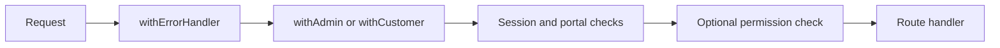

SaaS Foundation wraps API route handlers with a small set of middleware-style
functions. These wrappers keep authentication, portal context, permission
checks, and error formatting consistent without repeating them inside every
route.

## Admin routes

`withAdmin` protects admin-scoped API routes.

For each request, it:

1. Loads the current session.
2. Returns `401 Unauthorized` when there is no authenticated user.
3. Checks that `user.role` is set and returns `403 Forbidden` when it is not.
4. Applies an optional permission check through `withPermission`.
5. Passes the authenticated user and session to the route as `adminContext`.

```ts
export const POST = withAdmin(
  async (request, context, adminContext) => {
    // Handle the authenticated admin request.
  },
  { organization: ["create"] },
);
```

The wrapper is defined in `src/app/api/admin/with-admin.ts`.

## Customer routes

`withCustomer` protects organization-scoped API routes.

For each request, it:

1. Loads the current session.
2. Returns `401 Unauthorized` when there is no authenticated user.
3. Reads the active organization from the session.
4. Verifies that the user is a member of that organization.
5. Applies an optional organization permission check.
6. Passes the user, session, membership, and trusted organization ID to the
   route as `customerContext`.

```ts
export const POST = withCustomer(
  async (request, context, customerContext) => {
    const { organizationId, membership } = customerContext;
    // Handle the request within this organization.
  },
  { invitation: ["create"] },
);
```

The wrapper is defined in `src/app/api/customer/with-customer.ts`. The
organization ID it provides should be used to scope customer repository
queries.

The organization switcher updates `activeOrganizationId` on the Better Auth
session. Subsequent customer requests automatically resolve the new active
organization and its corresponding membership. See [Portals](/portals) for the
full portal-context model.

## Permission checks

`withPermission` checks admin portal permissions through Better Auth. It accepts
the resource and actions required by a route, returns `403 Forbidden` when the
check fails, and only calls the route handler when access is allowed.

Customer permission checks happen inside `withCustomer` because they also need
the active organization ID.

See [Roles and permissions](/roles-and-permissions) for the permissions assigned
to each portal role.

## Error handling

Both portal wrappers compose `withErrorHandler`, which provides one error
boundary around the route.

The current handler catches `ZodError` and converts it into the standard
`400 Bad Request` validation response. Errors it does not recognize are
re-thrown so the framework can handle them instead of silently returning an
incorrect response.

```text
Route handler throws
├── ZodError     → formatted validation response
└── Other error  → re-thrown
```

This boundary is also the natural place to add reporting for unexpected errors.
For example, you can send the exception and request context to your logging or
error-monitoring service before re-throwing it.

See [API format](/api-format) for the validation and error response shapes.

## Wrapper composition

Route handlers remain focused on the operation itself because the wrappers deal
with the request context first.


