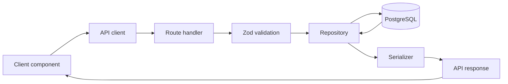

SaaS Foundation uses a small set of consistent patterns throughout the
application. The goal is to make it clear where code belongs, how data moves,
and which trust boundary applies.

## Admin and customer boundaries

Many parts of the application are scoped to either the admin portal or the
customer portal. This separation appears in routes, API clients, repositories,
authorization, and UI components.

- **Admin-scoped code** may operate across the platform and across organizations.
- **Customer-scoped code** operates within the authenticated organization.

Keeping those paths separate makes the access boundary visible in the project
structure. It also reduces the chance that platform-wide behavior leaks into a
customer workflow.

Read [Portals](/portals) and [Roles and permissions](/roles-and-permissions) for
more about the two access models.

## Request lifecycle

A typical API request moves through the same layers:

The route handler coordinates the request. It validates the input, performs any
authorization and business-rule checks, calls a repository, serializes the
result, and returns one of the application's standard API response formats.

## Architectural patterns

<CardGroup cols={2}>
  <Card title="API architecture" icon="route" href="/architecture-api">
    Use one consistent interface for reads and mutations while keeping future
    consumers open.
  </Card>
  <Card title="Repositories" icon="database" href="/architecture-repositories">
    Keep Prisma access behind entity repositories and preserve portal trust
    boundaries.
  </Card>
  <Card title="Validation" icon="circle-check" href="/architecture-validation">
    Validate every backend input and share Zod schemas where the same rules
    apply to frontend forms.
  </Card>
  <Card title="Serialization" icon="code-compare" href="/architecture-serialization">
    Make every frontend data shape explicit at API and Server Component
    boundaries.
  </Card>
  <Card title="Coding agents" icon="sparkles" href="/ai-assistance">
    Use the included agent instructions and authentication skills to build in
    line with the existing architecture.
  </Card>
</CardGroup>

These patterns are intentionally conventional. A developer coming from a
frontend, backend, or API background should be able to follow the application
without first deciding between several ways to perform the same operation.
